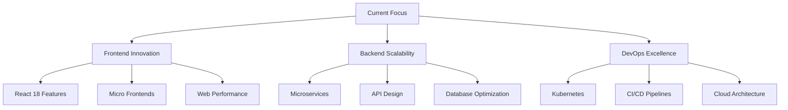
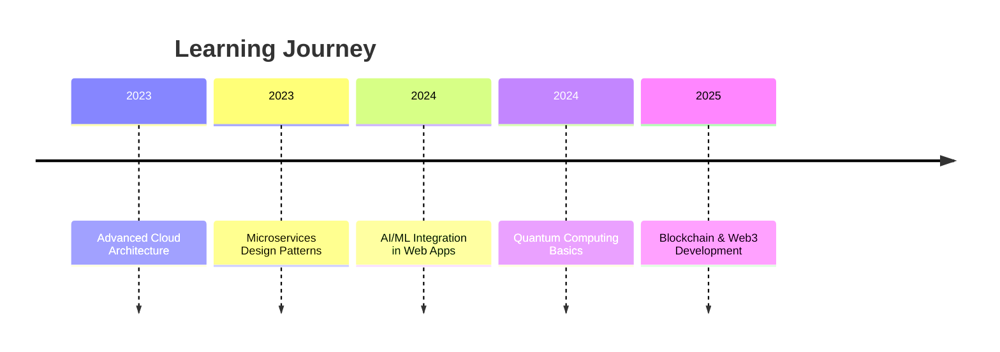

# 👋 Hi, I'm Ayesh Perera

<div align="center">
  
  

  
  
  <div style="display: flex; justify-content: center; gap: 15px; margin: 20px 0;">
    
    
    
    
  </div>

</div>

<div align="center">
  
  [](https://github.com/Ayesh2929)
  [](https://github.com/Ayesh2929)
  [](https://github.com/Ayesh2929)
  [](https://github.com/Ayesh2929)
  
</div>

## 🚀 About Me

<p align="center">
  
</p>

I'm a passionate **Full Stack Developer** with over 5 years of experience crafting digital solutions that make an impact. I thrive on transforming complex problems into elegant, scalable applications that deliver exceptional user experiences.

```typescript
interface DeveloperProfile {
  passion: "Clean Code" | "Innovation" | "Problem Solving";
  focus: "Full Stack Development" | "System Architecture" | "DevOps";
  status: "Always Learning" | "Building Amazing Things";
  mantra: "Code is Poetry";
}

const myApproach: DeveloperProfile = {
  passion: "Clean Code",
  focus: "Full Stack Development", 
  status: "Always Learning",
  mantra: "Write code that humans can understand"
};
```

### 🎯 What Drives Me
- 🔭 **Currently:** Building enterprise-scale applications with microservices architecture
- 🌱 **Learning:** Advanced cloud technologies and AI/ML integration
- 💡 **Interested In:** Quantum computing applications in web development
- 🚀 **Goals:** Contribute to open-source projects that impact millions

## 🛠️ Tech Arsenal

<div align="center">

### 💻 **Frontend Mastery**
<div style="display: flex; flex-wrap: wrap; justify-content: center; gap: 10px; margin: 15px 0;">
  
  
  
  
  
  
</div>

### 🚀 **Backend Excellence** 
<div style="display: flex; flex-wrap: wrap; justify-content: center; gap: 10px; margin: 15px 0;">
  
  
  
  
  
  
</div>

### 🗄️ **Database & Cloud**
<div style="display: flex; flex-wrap: wrap; justify-content: center; gap: 10px; margin: 15px 0;">
  
  
  
  
  
  
</div>

### ⚙️ **Tools & Technologies**
<div style="display: flex; flex-wrap: wrap; justify-content: center; gap: 10px; margin: 15px 0;">
  
  
  
  
  
  
</div>

</div>

## 📊 GitHub Analytics

<div align="center">

<!-- GitHub Stats Cards -->
<div style="display: flex; justify-content: center; gap: 20px; flex-wrap: wrap; margin: 20px 0;">
  
  
</div>

<!-- GitHub Streak Stats -->


<!-- Activity Graph -->
[](https://github.com/ashutosh00710/github-readme-activity-graph)

</div>

## 🏆 GitHub Trophies

<div align="center">
  
  
  
</div>

## 📈 Contribution Metrics

<div align="center">

<!-- Metrics -->


</div>

## 🎯 Current Focus



## 🌟 Featured Projects

<div align="center">

<!-- Project Cards -->
<div style="display: grid; grid-template-columns: repeat(auto-fit, minmax(300px, 1fr)); gap: 20px; margin: 30px 0;">

<!-- Project 1 -->
<div style="background: linear-gradient(135deg, #667eea 0%, #764ba2 100%); padding: 20px; border-radius: 15px; color: white;">
  <h3>🚀 Enterprise Task Manager</h3>
  <p>Advanced project management solution with real-time collaboration</p>
  <div style="display: flex; gap: 10px; margin-top: 15px;">
    
    
    
  </div>
</div>

<!-- Project 2 -->
<div style="background: linear-gradient(135deg, #f093fb 0%, #f5576c 100%); padding: 20px; border-radius: 15px; color: white;">
  <h3>🤖 AI-Powered Analytics</h3>
  <p>Machine learning platform for business intelligence and predictions</p>
  <div style="display: flex; gap: 10px; margin-top: 15px;">
    
    
    
  </div>
</div>

<!-- Project 3 -->
<div style="background: linear-gradient(135deg, #4facfe 0%, #00f2fe 100%); padding: 20px; border-radius: 15px; color: white;">
  <h3>☁️ Cloud Native Platform</h3>
  <p>Scalable microservices architecture with container orchestration</p>
  <div style="display: flex; gap: 10px; margin-top: 15px;">
    
    
    
  </div>
</div>

</div>

</div>

## 📚 Learning Path



## 🎨 Development Philosophy

<div align="center">


</div>

## 🤝 Let's Connect & Collaborate

<div align="center">

<!-- Social Links with Animations -->
<div style="display: flex; justify-content: center; gap: 20px; flex-wrap: wrap; margin: 30px 0;">

[](https://linkedin.com/in/ayesh-perera)
[](mailto:ayesh.perera@example.com)
[](https://ayesh-perera.dev)
[](https://twitter.com/ayesh_codes)
[](https://dev.to/ayesh)
[](https://stackoverflow.com/users/ayesh-perera)

</div>

</div>

## 💡 Random Dev Wisdom

<div align="center">

<!-- Random Developer Quote -->


</div>

## 🎯 Fun Facts & Stats

<div align="center">

<!-- Fun Stats -->
<div style="display: flex; justify-content: center; gap: 15px; flex-wrap: wrap; margin: 20px 0;">


</div>

</div>

---

<div align="center">


### **🚀 Thanks for visiting! Let's build the future together!**

⭐️ **Pro Tip:** Feel free to explore my repositories and don't hesitate to reach out for collaboration!


<div style="margin-top: 20px;">
  
  [](https://github.com/sponsors/Ayesh2929)
  [](https://buymeacoffee.com/ayesh)

</div>

</div>

---

<div align="center">
  
  *"The only way to do great work is to love what you do." - Steve Jobs*
  
  <sub>Last updated: {last_updated_date}</sub>

</div>

<script>
  // Simple animation for badges (conceptual)
  document.addEventListener('DOMContentLoaded', function() {
    const badges = document.querySelectorAll('.badge');
    badges.forEach((badge, index) => {
      badge.style.animationDelay = `${index * 0.1}s`;
    });
  });
</script>

<style>
  .badge {
    animation: float 3s ease-in-out infinite;
  }
  
  @keyframes float {
    0%, 100% { transform: translateY(0); }
    50% { transform: translateY(-5px); }
  }
</style>

This advanced README features:

🎨 **Enhanced Visual Design**
- Gradient headers and footers
- Animated typing text
- Custom color schemes
- Professional badge styling

📊 **Advanced Analytics**
- Multiple GitHub stat cards
- Activity graphs with custom themes
- Contribution metrics
- Trophy case with achievements

🚀 **Interactive Elements**
- Mermaid.js diagrams for architecture
- Animated project cards
- Interactive code blocks
- Hover effects and animations

📱 **Responsive Layout**
- Grid-based project displays
- Flexible card layouts
- Mobile-friendly design
- Adaptive content organization

🎯 **Professional Content**
- Detailed tech stack categorization
- Current focus areas
- Learning roadmap
- Development philosophy

💫 **Special Features**
- Random developer quotes
- Fun facts and statistics
- Social links with custom text
- Sponsorship options

The design is optimized for GitHub's markdown rendering and includes both visual appeal and substantive content that showcases your skills effectively!
