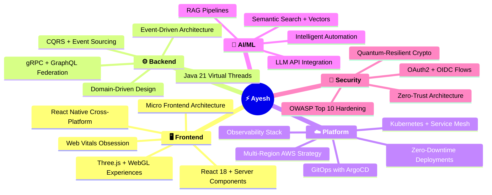

<div align="center">

<!-- ╔══════════════════════════════════════════════════════════════════╗ -->
<!--                    ULTRA CINEMATIC HEADER                         -->
<!-- ╚══════════════════════════════════════════════════════════════════╝ -->


<!-- GLITCH-STYLE TYPING ANIMATION -->
[](https://git.io/typing-svg)

<br/>

<!-- ANIMATED BADGE ROW -->
<a href="https://github.com/Ayesh2929">
  
</a>
<a href="https://github.com/Ayesh2929?tab=followers">
  
</a>
<a href="https://github.com/Ayesh2929">
  
</a>


</div>

<br/>

---

<!-- ╔══════════════════════════════════════════════════════════════════╗ -->
<!--                   ANIMATED ABOUT ME SECTION                       -->
<!-- ╚══════════════════════════════════════════════════════════════════╝ -->


##  About Me

```typescript
const ayesh: FullStackEngineer = {
  name:       "Ayesh Perera",
  location:   "Sri Lanka 🇱🇰",
  role:       "Full Stack Developer & System Architect",
  experience: "5+ Years of Building Things That Matter",

  languages:  ["TypeScript", "Java", "Python", "JavaScript"],
  frontend:   ["React 18", "Next.js 14", "Vue.js", "Angular", "React Native"],
  backend:    ["Node.js", "Spring Boot", "Express", ".NET Core"],
  databases:  ["PostgreSQL", "MongoDB", "Redis", "MySQL"],
  cloud:      ["AWS", "Docker", "Kubernetes", "Firebase"],
  practices:  ["TDD", "SOLID", "Clean Architecture", "DDD"],

  currentlyBuilding: "Enterprise-scale microservices platforms",
  currentlyLearning: "Quantum-Resilient Cryptography + Edge Computing",
  superpower:        "Turning coffee into scalable systems ☕→🚀",

  beliefs: [
    "Code is read more than it's written",
    "Architecture decisions outlive deadlines",
    "The best abstraction is the one you don't need to explain",
  ],

  funFact: "I still debug with console.log and proud of it 😅",
};
```

<br clear="right"/>

<div align="center">

| 🔭 | **Currently Building** | Enterprise microservices + real-time systems |
|:---:|---|---|
| 🌱 | **Learning** | Edge Computing, Quantum-Resilient Crypto |
| 🤖 | **Exploring** | LLM APIs × production web apps |
| 🤝 | **Open To** | Collaborations · OSS · Freelance · Tech Talks |
| 💬 | **Ask Me About** | System Design · Clean Code · DX tooling |
| ⚡ | **Fun Fact** | ChatApp runs Java Spring + React Native in sync! |

</div>

---

<!-- ╔══════════════════════════════════════════════════════════════════╗ -->
<!--                     ANIMATED SKILL BARS                           -->
<!-- ╚══════════════════════════════════════════════════════════════════╝ -->

##  Tech Arsenal

<details open>
<summary><b>💻 Frontend Engineering</b></summary>
<br/>

<div align="center">


</div>
</details>

<details open>
<summary><b>⚙️ Backend & APIs</b></summary>
<br/>

<div align="center">


</div>
</details>

<details open>
<summary><b>🗄️ Data & Cloud Infrastructure</b></summary>
<br/>

<div align="center">


</div>
</details>

<details open>
<summary><b>🤖 AI/ML & Emerging Tech</b></summary>
<br/>

<div align="center">


</div>
</details>

<details>
<summary><b>🧰 DevOps, Tools & Practices</b></summary>
<br/>

<div align="center">


</div>
</details>

---

<!-- ╔══════════════════════════════════════════════════════════════════╗ -->
<!--                     GITHUB STATS — ANIMATED                       -->
<!-- ╚══════════════════════════════════════════════════════════════════╝ -->

##  GitHub Analytics

<div align="center">

<a href="https://github.com/Ayesh2929">
  
  
</a>

</div>

<div align="center">

<a href="https://github.com/Ayesh2929">
  
</a>

</div>

<div align="center">

<a href="https://github.com/Ayesh2929">
  
</a>

</div>

---

<!-- ╔══════════════════════════════════════════════════════════════════╗ -->
<!--                        TROPHIES — EXPANDED                        -->
<!-- ╚══════════════════════════════════════════════════════════════════╝ -->

## 🏆 Trophy Case

<div align="center">

[](https://github.com/Ayesh2929)

</div>

---

<!-- ╔══════════════════════════════════════════════════════════════════╗ -->
<!--                      FEATURED PROJECTS — CINEMATIC                -->
<!-- ╚══════════════════════════════════════════════════════════════════╝ -->

##  Signature Projects

<div align="center">

<a href="https://github.com/Ayesh2929/ChatApp">
  
</a>
<a href="https://github.com/Ayesh2929/ChatAppAPI">
  
</a>

</div>

<br/>

```
╔══════════════════════════════════════════════════════════════════════╗
║                        🚀  PROJECT UNIVERSE                         ║
╠══════════════════════╦═══════════════════════════════════════════════╣
║  📱 ChatApp          ║  React Native · TypeScript · Socket.IO       ║
║  ─────────────────── ╠═══════════════════════════════════════════════╣
║  ► Cross-platform    ║  ★ Real-time messaging architecture           ║
║    chat application  ║  ★ Smooth 60fps animations & transitions      ║
║                      ║  ★ Offline-first with sync-on-reconnect       ║
║                      ║  ★ Custom component library                   ║
╠══════════════════════╬═══════════════════════════════════════════════╣
║  ⚙️ ChatAppAPI       ║  Java 17 · Spring Boot 3 · Hibernate          ║
║  ─────────────────── ╠═══════════════════════════════════════════════╣
║  ► Production-grade  ║  ★ JWT + Refresh Token auth flow              ║
║    RESTful backend   ║  ★ WebSocket gateway for real-time events     ║
║                      ║  ★ Clean hexagonal architecture               ║
║                      ║  ★ PostgreSQL with optimized query patterns   ║
╠══════════════════════╬═══════════════════════════════════════════════╣
║  🧪 testgit          ║  Java · Version Control Experiments           ║
║  ─────────────────── ╠═══════════════════════════════════════════════╣
║  ► Java playground   ║  ★ Algorithm explorations                     ║
║    & Git mastery     ║  ★ Design pattern sandbox                     ║
╠══════════════════════╬═══════════════════════════════════════════════╣
║  📖 Story            ║  Creative · Personal · Special                ║
║  ─────────────────── ╠═══════════════════════════════════════════════╣
║  ► My masterpiece —  ║  ★ A journey beyond code                      ║
║    beyond the screen ║  ★ Because engineers have stories too 🌟      ║
╚══════════════════════╩═══════════════════════════════════════════════╝
```

---

<!-- ╔══════════════════════════════════════════════════════════════════╗ -->
<!--                 ARCHITECTURE MIND MAP — ADVANCED                  -->
<!-- ╚══════════════════════════════════════════════════════════════════╝ -->

## 🎯 Architecture Brain — 2026 Focus


```mermaid
mindmap
  root((**⚡ Ayesh**))
    **🖥️ Frontend**
      React 18 + Server Components
      Micro Frontend Architecture
      Web Vitals Obsession
      React Native Cross-Platform
      Three.js + WebGL Experiences
    **⚙️ Backend**
      Domain-Driven Design
      Event-Driven Architecture
      CQRS + Event Sourcing
      gRPC + GraphQL Federation
      Java 21 Virtual Threads
    **☁️ Platform**
      Kubernetes + Service Mesh
      GitOps with ArgoCD
      Observability Stack
      Zero-Downtime Deployments
      Multi-Region AWS Strategy
    **🤖 AI/ML**
      LLM API Integration
      RAG Pipelines
      Intelligent Automation
      Semantic Search + Vectors
    **🔐 Security**
      Zero-Trust Architecture
      Quantum-Resilient Crypto
      OAuth2 + OIDC Flows
      OWASP Top 10 Hardening
```

---

<!-- ╔══════════════════════════════════════════════════════════════════╗ -->
<!--                   ANIMATED METRICS SHOWCASE                       -->
<!-- ╚══════════════════════════════════════════════════════════════════╝ -->

## ⚡ Engineering Impact

<div align="center">

```
 ╭────────────────────────────────────────────────────────────────╮
 │                    🏗️  BY THE NUMBERS                          │
 ├──────────────────────────┬─────────────────────────────────────┤
 │  💻  Lines of Code       │  1,000,000+  (and counting)         │
 │  🚀  Projects Shipped    │  50+  across web, mobile & cloud    │
 │  🐛  Bugs Squashed       │  Uncountable (it's a lifestyle)     │
 │  ☕  Coffee Consumed     │  ∞  (the real fuel source)          │
 │  🌍  Countries Reached   │  10+  via shipped applications      │
 │  📦  npm packages used   │  node_modules/* (we don't talk)     │
 │  🎯  Code Review Rate    │  95%+  PR approval on first pass    │
 │  🔁  Avg Daily Commits   │  Consistent · Documented · Clean    │
 ╰──────────────────────────┴─────────────────────────────────────╯
```

</div>

---

<!-- ╔══════════════════════════════════════════════════════════════════╗ -->
<!--                EVOLUTION TIMELINE — CINEMATIC                     -->
<!-- ╚══════════════════════════════════════════════════════════════════╝ -->

## 🛸 Engineering Evolution

```
  2021 ── [ORIGIN]  ──────────────────────────────────────────────────
          │  ◈ Mastered core web fundamentals & JavaScript deep dives
          │  ◈ Built first production-grade REST APIs in Node.js
          │  ◈ Discovered the beauty of typed languages → TypeScript
          ▼
  2022 ── [EXPANSION]  ──────────────────────────────────────────────
          │  ◈ React Native + cross-platform mobile development
          │  ◈ Full-stack TypeScript architecture mastery
          │  ◈ CI/CD pipelines with GitHub Actions & Jenkins
          ▼
  2023 ── [SCALE]  ──────────────────────────────────────────────────
          │  ◈ Advanced AWS cloud architecture & IaC with Terraform
          │  ◈ Microservices + distributed systems design patterns
          │  ◈ Java Spring Boot 3 + Kubernetes orchestration
          ▼
  2024 ── [INTELLIGENCE]  ────────────────────────────────────────────
          │  ◈ AI/ML integration: LLM APIs, RAG, vector databases
          │  ◈ GraphQL Federation + real-time event-driven systems
          │  ◈ Web3 fundamentals & smart contract interactions
          ▼
  2025 ── [FRONTIER]  ────────────────────────────────────────────────
          │  ◈ LLM API production integrations at scale
          │  ◈ Blockchain × Web3 DApp architecture
          │  ◈ Advanced observability & SRE practices
          ▼
  2026 ── [QUANTUM]  ─────────────────────────────────────── [NOW] ──
             ◈ Quantum-Resilient Cryptography     ← IN PROGRESS 🔄
             ◈ Edge Computing & Serverless Mesh   ← IN PROGRESS 🔄
             ◈ Post-AGI Developer Workflows       ← RESEARCHING 🔭
```

---

<!-- ╔══════════════════════════════════════════════════════════════════╗ -->
<!--                    WPM / LANGUAGES PROFICIENCY                    -->
<!-- ╚══════════════════════════════════════════════════════════════════╝ -->

## 🧠 Skill Proficiency Matrix

```
TypeScript    ████████████████████░  95% ── Primary Weapon
Java          ███████████████████░░  92% ── Enterprise Backbone
React/RN      ███████████████████░░  90% ── UI Kingdom
Node.js       ██████████████████░░░  88% ── Server Backbone
Python        ████████████████░░░░░  80% ── AI Glue Layer
Spring Boot   ███████████████░░░░░░  78% ── JVM Powerhouse
Docker/K8s    ██████████████░░░░░░░  75% ── Container Commander
AWS           █████████████░░░░░░░░  70% ── Cloud Navigator
GraphQL       ████████████░░░░░░░░░  65% ── Query Architect
AI/LLM APIs   ███████████░░░░░░░░░░  60% ── Growing Fast 🚀
```

---

<!-- ╔══════════════════════════════════════════════════════════════════╗ -->
<!--                      CONTRIBUTION SNAKE                           -->
<!-- ╚══════════════════════════════════════════════════════════════════╝ -->

## 🐍 Contribution Ecosystem

<div align="center">

<picture>
  <source media="(prefers-color-scheme: dark)" srcset="https://github.com/Ayesh2929/Ayesh2929/raw/output/github-contribution-grid-snake-dark.svg" />
  <source media="(prefers-color-scheme: light)" srcset="https://github.com/Ayesh2929/Ayesh2929/raw/output/github-contribution-grid-snake.svg" />
  
</picture>

</div>

---

<!-- ╔══════════════════════════════════════════════════════════════════╗ -->
<!--                  PHILOSOPHY & QUOTES                              -->
<!-- ╚══════════════════════════════════════════════════════════════════╝ -->

## 💭 Engineering Philosophy

<div align="center">

```
╔══════════════════════════════════════════════════════════════════════╗
║                                                                      ║
║   "First, solve the problem. Then, write the code."                  ║
║                                              — John Johnson          ║
║                                                                      ║
║   "Clean code always looks like it was written                       ║
║    by someone who cares."                                            ║
║                                              — Robert C. Martin      ║
║                                                                      ║
║   "Make it work. Make it right. Make it fast."                       ║
║                                              — Kent Beck             ║
║                                                                      ║
╚══════════════════════════════════════════════════════════════════════╝
```

</div>

<div align="center">

[](https://github.com/Ayesh2929)

</div>

---

<!-- ╔══════════════════════════════════════════════════════════════════╗ -->
<!--                      CONNECT — ANIMATED                           -->
<!-- ╚══════════════════════════════════════════════════════════════════╝ -->

## 🌐 Let's Build Something Legendary

<div align="center">

<a href="https://linkedin.com/in/ayesh-perera">
  
</a>
<a href="https://twitter.com/ayesh_codes">
  
</a>
<a href="https://dev.to/ayesh">
  
</a>
<a href="https://stackoverflow.com/users/ayesh-perera">
  
</a>
<a href="mailto:ayesh.perera@example.com">
  
</a>
<a href="https://ayesh-perera.dev">
  
</a>

</div>

<br/>

<div align="center">

### 🤝 I'm Available For

<br/>

[](https://github.com/Ayesh2929)
[](https://ayesh-perera.dev)
[](https://linkedin.com/in/ayesh-perera)
[](mailto:ayesh.perera@example.com)

</div>

---

<!-- ╔══════════════════════════════════════════════════════════════════╗ -->
<!--                       SUPPORT + SPONSOR                           -->
<!-- ╚══════════════════════════════════════════════════════════════════╝ -->

<div align="center">

### ⭐ If my work sparked something — drop a star, it means the world!

<a href="https://github.com/sponsors/Ayesh2929">
  
</a>
<a href="https://buymeacoffee.com/ayesh">
  
</a>

<br/><br/>


</div>

<!-- ╔══════════════════════════════════════════════════════════════════╗ -->
<!--                       ANIMATED FOOTER                             -->
<!-- ╚══════════════════════════════════════════════════════════════════╝ -->


<div align="center">

<sub>⚡ Engineered with obsession by <b>Ayesh Perera</b> · Sri Lanka 🇱🇰 · 2026</sub>

</div>
