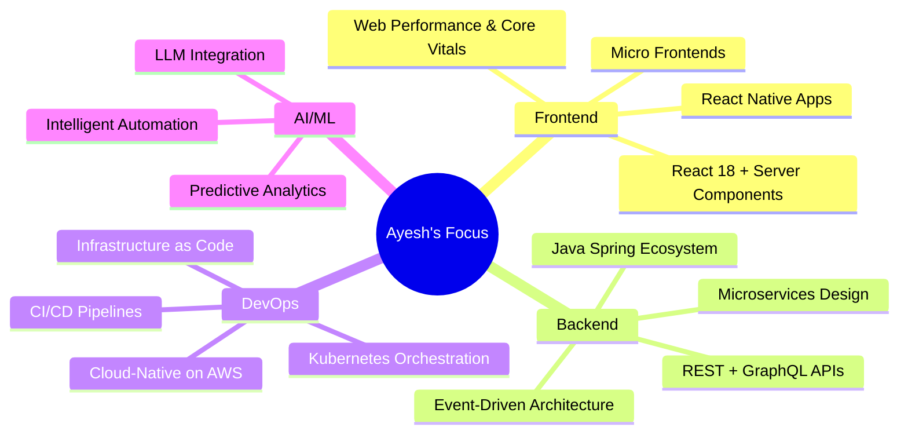

<div align="center">

<!-- ══════════════════════════════════════════════════════════════════ -->
<!--                        ANIMATED HEADER                           -->
<!-- ══════════════════════════════════════════════════════════════════ -->


<!-- ══════════════════════════════════════════════════════════════════ -->
<!--                        TYPING ANIMATION                          -->
<!-- ══════════════════════════════════════════════════════════════════ -->

[](https://git.io/typing-svg)

<!-- ══════════════════════════════════════════════════════════════════ -->
<!--                     PROFILE BADGES ROW                           -->
<!-- ══════════════════════════════════════════════════════════════════ -->

<br/>

[](https://github.com/Ayesh2929)
[](https://github.com/Ayesh2929?tab=followers)
[](https://github.com/Ayesh2929)
[](https://github.com/Ayesh2929)
[](https://github.com/Ayesh2929)

</div>

---

<!-- ══════════════════════════════════════════════════════════════════ -->
<!--                        ABOUT ME SECTION                          -->
<!-- ══════════════════════════════════════════════════════════════════ -->


## 🧑‍💻 About Me

```typescript
const ayesh: Developer = {
  name:       "Ayesh Perera",
  location:   "Sri Lanka 🇱🇰",
  role:       "Full Stack Developer",
  experience: "5+ Years",

  languages:  ["TypeScript", "Java", "Python", "JavaScript"],
  frontend:   ["React", "Next.js", "Vue.js", "Angular"],
  backend:    ["Node.js", "Express", "Spring Boot", ".NET"],
  databases:  ["PostgreSQL", "MongoDB", "Redis"],
  cloud:      ["AWS", "Docker", "Kubernetes"],

  currentFocus: [
    "Microservices Architecture",
    "AI/ML Integration",
    "Cloud-Native Development",
  ],

  funFact:    "I debug with console.log and I'm not ashamed 😅",
  mantra:     "Write code that humans can understand 🧠",
};
```

<br clear="right"/>

### 🌟 What I'm Up To

| 🔭 Building | Enterprise-scale apps with microservices architecture |
|------------|-------------------------------------------------------|
| 🌱 Learning | Advanced cloud infra & AI/ML for web apps |
| 💡 Exploring | Quantum computing in modern web development |
| 🤝 Open To | Collaborations, open-source contributions, freelance |
| 💬 Ask Me About | Full-stack dev, system design, clean code |
| ⚡ Fun Fact | My ChatApp project runs on Java + React Native! |

---

<!-- ══════════════════════════════════════════════════════════════════ -->
<!--                        TECH STACK SECTION                        -->
<!-- ══════════════════════════════════════════════════════════════════ -->

## 🛠️ Tech Arsenal

<details open>
<summary><b>💻 Frontend</b></summary>
<br/>


</details>

<details open>
<summary><b>⚙️ Backend</b></summary>
<br/>


</details>

<details open>
<summary><b>🗄️ Databases & Cloud</b></summary>
<br/>


</details>

<details>
<summary><b>🧰 Tools & Practices</b></summary>
<br/>


</details>

---

<!-- ══════════════════════════════════════════════════════════════════ -->
<!--                      GITHUB STATS SECTION                        -->
<!-- ══════════════════════════════════════════════════════════════════ -->

## 📊 GitHub Analytics

<div align="center">


</div>

<div align="center">

[](https://github.com/Ayesh2929)

</div>

<div align="center">

[](https://github.com/Ayesh2929)

</div>

---

<!-- ══════════════════════════════════════════════════════════════════ -->
<!--                      TROPHIES SECTION                            -->
<!-- ══════════════════════════════════════════════════════════════════ -->

## 🏆 GitHub Trophies

<div align="center">

[](https://github.com/Ayesh2929)

</div>

---

<!-- ══════════════════════════════════════════════════════════════════ -->
<!--                      FEATURED PROJECTS                           -->
<!-- ══════════════════════════════════════════════════════════════════ -->

## 🚀 Featured Projects

<div align="center">

| 💬 ChatApp | ⚙️ ChatAppAPI |
|:---:|:---:|
| [](https://github.com/Ayesh2929/ChatApp) | [](https://github.com/Ayesh2929/ChatAppAPI) |
| 📱 React Native real-time chat UI with smooth cross-platform UX | ⚙️ Java + Hibernate backend with auth, messaging & real-time API |

</div>

### 🔥 Project Highlights

```
┌─────────────────────────────────────────────────────────────────────┐
│  📱  ChatApp          │  React Native · TypeScript                  │
│     ➤ Cross-platform chat with real-time messaging                  │
│     ➤ Smooth animations, clean component architecture               │
│     ➤ Forked & extended with custom features                        │
├─────────────────────────────────────────────────────────────────────┤
│  ⚙️  ChatAppAPI       │  Java · Spring · Hibernate                  │
│     ➤ RESTful backend with JWT authentication                       │
│     ➤ Message storage, user management, real-time comms             │
│     ➤ Production-ready architecture with clean separation           │
├─────────────────────────────────────────────────────────────────────┤
│  🧪  testgit          │  Java                                       │
│     ➤ Experimental Java playground & version control practice       │
├─────────────────────────────────────────────────────────────────────┤
│  📖  Story            │  Creative Project                           │
│     ➤ My masterpiece — a personal creative endeavor                 │
└─────────────────────────────────────────────────────────────────────┘
```

---

<!-- ══════════════════════════════════════════════════════════════════ -->
<!--                    ARCHITECTURE FOCUS                            -->
<!-- ══════════════════════════════════════════════════════════════════ -->

## 🎯 Current Focus & Architecture Thinking


```mermaid
mindmap
  root((Ayesh's Focus))
    Frontend
      React 18 + Server Components
      Micro Frontends
      Web Performance & Core Vitals
      React Native Apps
    Backend
      Microservices Design
      REST + GraphQL APIs
      Event-Driven Architecture
      Java Spring Ecosystem
    DevOps
      Kubernetes Orchestration
      CI/CD Pipelines
      Cloud-Native on AWS
      Infrastructure as Code
    AI/ML
      LLM Integration
      Intelligent Automation
      Predictive Analytics
```

---

<!-- ══════════════════════════════════════════════════════════════════ -->
<!--                      CODING STATS                                -->
<!-- ══════════════════════════════════════════════════════════════════ -->

## ⏱️ Coding Philosophy & Stats

<div align="center">

| Metric | Value |
|--------|-------|
| 💻 Lines of Code Written | 1,000,000+ |
| ☕ Cups of Coffee Consumed | ∞ |
| 🐛 Bugs Squashed | Too Many to Count |
| 🚀 Projects Shipped | 50+ |
| 🌍 Countries Reached (via apps) | 10+ |
| 🔁 Git Commits | Counting... |

</div>

> *"First, solve the problem. Then, write the code."* — John Johnson
>
> *"Clean code always looks like it was written by someone who cares."* — Robert C. Martin

---

<!-- ══════════════════════════════════════════════════════════════════ -->
<!--                    LEARNING ROADMAP                              -->
<!-- ══════════════════════════════════════════════════════════════════ -->

## 📚 Learning Roadmap

```
2022 ──────── React Native & Cross-Platform Mobile
     ──────── Full-stack TypeScript Mastery
2023 ──────── Advanced Cloud Architecture (AWS)
     ──────── Microservices Design Patterns
2024 ──────── AI/ML Integration in Web Applications
     ──────── GraphQL & Real-Time Systems
2025 ──────── Blockchain & Web3 Fundamentals
     ──────── Large Language Model API Integrations
2026 ──────── Quantum-Resilient Cryptography [IN PROGRESS]
     ──────── Edge Computing & Serverless Architectures [IN PROGRESS]
```

---

<!-- ══════════════════════════════════════════════════════════════════ -->
<!--                    CONTRIBUTIONS SNAKE                           -->
<!-- ══════════════════════════════════════════════════════════════════ -->

## 🐍 Contribution Snake

<div align="center">


</div>

---

<!-- ══════════════════════════════════════════════════════════════════ -->
<!--                    CONNECT SECTION                               -->
<!-- ══════════════════════════════════════════════════════════════════ -->

## 🤝 Connect With Me

<div align="center">

[](https://linkedin.com/in/ayesh-perera)
[](https://twitter.com/ayesh_codes)
[](https://dev.to/ayesh)
[](https://stackoverflow.com/users/ayesh-perera)
[](mailto:ayesh.perera@example.com)
[](https://ayesh-perera.dev)

</div>

<div align="center">

### 💬 Open For

🤝 **Collaboration** on exciting open-source projects  
💼 **Freelance** full-stack development work  
🎙️ **Tech Talks** and knowledge sharing  
☕ **Coffee Chats** about tech, ideas, and innovation

</div>

---

<!-- ══════════════════════════════════════════════════════════════════ -->
<!--                      RANDOM QUOTE                                -->
<!-- ══════════════════════════════════════════════════════════════════ -->

<div align="center">

[](https://github.com/Ayesh2929)

</div>

---

<!-- ══════════════════════════════════════════════════════════════════ -->
<!--                      SUPPORT SECTION                             -->
<!-- ══════════════════════════════════════════════════════════════════ -->

<div align="center">

### ⭐ If my work has helped you, give it a star!

[](https://github.com/sponsors/Ayesh2929)
[](https://buymeacoffee.com/ayesh)

</div>

<!-- ══════════════════════════════════════════════════════════════════ -->
<!--                       FOOTER WAVE                                -->
<!-- ══════════════════════════════════════════════════════════════════ -->


<div align="center">

*Made with ❤️ by Ayesh Perera · Last updated: 2026*

</div>
